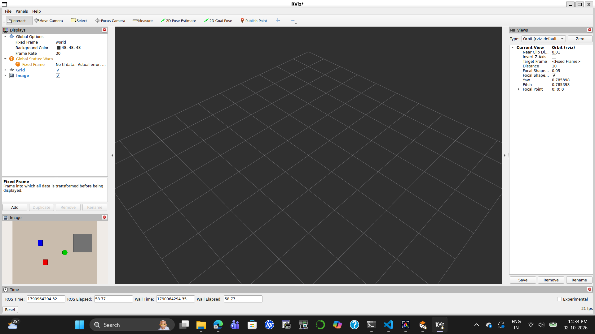

# Vision-Guided Pick-and-Place (ROS 2 + Gazebo + MoveIt 2)

**Task:** Pick 3 object types (cube, cylinder, box) from a table and place them in a bin.
**Metrics:** grasp success rate, detection mAP, cycle time, pose error (mm).
**v1 constraint:** top-down grasps only.
